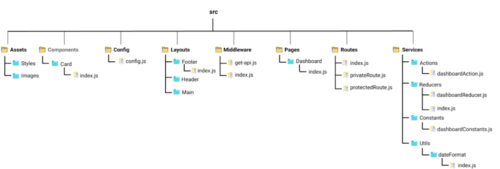

# Odws Note App React Projesi               

Odws not uygulamsının ön yüz uygulaması için React tercih ettim. React'ı tercih etmemin nedeni hem bilmediğim bir teknolojiyi öğrenmek ve bir web geliştiricisinin mutlaka öğrenmesi gereken bir teknoloji olması hasebiyle tercih etmiş bulundum.

React bir framework değildir bir kütüphanedir ve virtual DOM yapısını kullanır. Değişiklikleri ilk önce virtual DOM üzerinde yapar ve gerçek DOM'a yansıtır. JSX formatı sayesinde JS içerisine HTML kodu yazabilme imkanı sunar.

## Odws Proje Yapısı

Bu proje başlamadan önce bir takım araştırmalar yaptım. Bu araştırmalar neticesinde proje yapısı nasıl olmalı ? gibi bir çok soruya ufakta olsa cevaplar buldum. Proje klasör yapısını aşağıdaki grafikte görüldüğü gibi yapmaya karar verdim.

Bu yapıyı akılda daha kalıcı olması için kısaca açıklamak istiyorum.

## Assets
Assets klasoründe projemizin CSS, Images gibi Componentlerimizin ve sayfalarımızın ihtiyaç duyduğu kaynakları burada tutuyoruz. CSS dosyalarını istersek ilgili component veya pages klasörü içinde de tutabiliriz ama bu tamamen developerların yoğurt yiyişi ile alakalı olduğu için tercih sizlerin :)

## Layouts

Aslında ASP.NET MVC kodlayanlar bu klasör hakkında fikir sahibi olduklarını düşünüyorum :) Bu klasörde projemizde sabit olan Header,Footer gibi alanları tanımlıyorz.

## Components

Proje genelinde kullanılan Buton, Modal, Form Input gibi UI Componentleri bu klasör içinde oluştururuz ve projenin her yerinde bu componentleri çağırarak kullanabiliriz. Bileşenleri test etmek istiyorsak Unit Test için gerekli JS dosyasınıda ilgili componentin içinde tanımlayabiliriz.

## Pages
Bu klasör React uygulamasında ki route'lara ait sayfalarını tanımladığımız yerdir. Bu klasördeki her bir sayfa kendi route tanımını içerir.

## Middleware
API kullanımlarınıda, subscribes ve DOM'un manuel olarak değiştirilmesi gibi işlemlere side effects denir. Middleware klasöründe bu gibi operasyonların tanımlamalarını yapar ve kullanırız.

## Routes
Bu klasörde uygulamamızda kullanılan route tanımlamaları vardır. Private ve protected vb. route tanımlamalarını bu klasor içerisinde gerçekleştiririz.

## Config
Bu klasör içerisinde uygulamamıza ait environment variablerımızı config.js aracılığı ile tanımlıyoruz. Çoklu environment tanımlamalarını burada yapacağız.

## Services
Projemizde Redux kullanacağız. Stateleri yönetmek için bu klasör içerinde Actions, Reducers ve Constants adında 3 klasör oluşturuyoruz. Actionslar ve Reducerlar hemen hemen tüm sayfalarda çağıralacağı için Page adına göre Actions, Reducers ve Constantslarımız burada oluşturuyoruz.

## Utils
Projemizde sürekli tekrar tekrar kullanılacak yapıları burada tanımlıyoruz ve bu sayede daha merkezi bir yapı oluşturuyoruz. Data formatting, Regex, Dropdown options, common js functionlarımız gibi tanımlamaları burada oluşturup kullancağız.

### Final
Son olarak proje mimarimiz bu şekilde olacak. Projenin ilerleyen aşamalarında mimarimiz değişebileceği için burada fazla kafa yormadan kervan yolda düzülür mantığını bi tık benimseyerek yolumuza devam etmek daha mantıklı geliyor.

